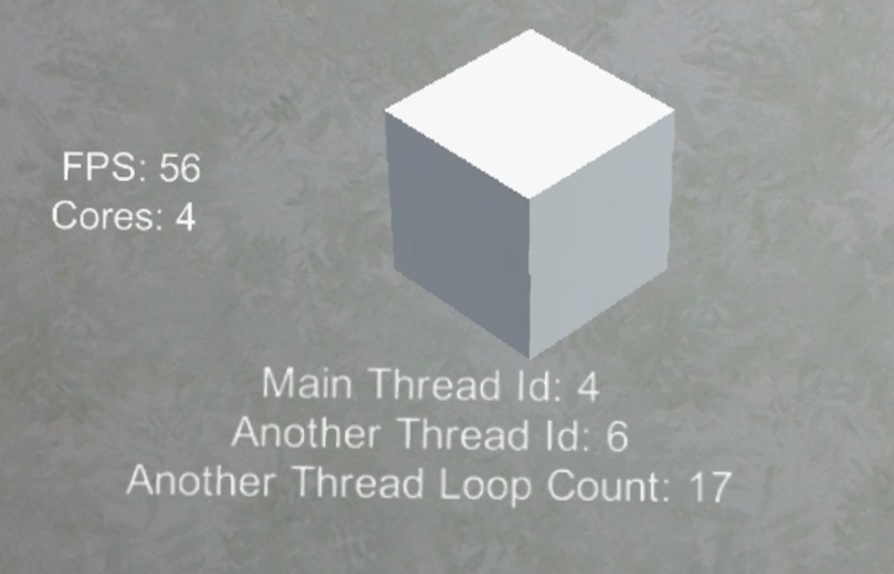
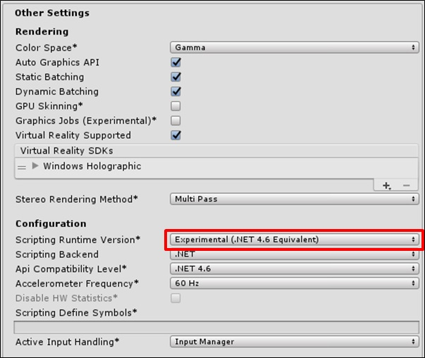

# Multithread Sample for HoloLens

# Tools
* Unity 2017.1.2f1
* Visual Studio 2017

# Devices
* Microsoft HoloLens

# Settings
## Unity
* Player Settings > Other Settings > Scripting Runtime Version

